<div align="center">

<h3><code>arijit@github:~$ ./contributions.sh</code></h3>



<br><br>

<h3><code>arijit@github:~$ whoami</code></h3>

<table>
<tr>

<td valign="top">

</td>

<td valign="top">

</td>

</tr>
</table>

</div>

<details>
<summary><code>arijit@github:~$ cat backend-lab.md</code></summary>

<br>

A tiny nighttime workshop. Five agents work around a server core: one sketches
at the architecture board, one builds at a laptop, one reads a code display, one
carries a tablet between stations, one is crouched over a diagnostic trace. The
core is the anchor -- a drum whose backend architecture is projected in the air
above it, `API` branching to a service and on to a cache and a store.

| | |
|---|---|
| artwork | `assets/source/backend-lab-reference.png` -- the source of truth |
| tracer | `scripts/make_backend_lab.py` |
| animation | `scripts/backend_lab_anim.py` |
| animated | `assets/backend-lab.svg` (640&times;640, in the README above) |
| static | `assets/backend-lab-static.svg` -- same frame, no motion |
| avatar | `assets/backend-lab-{640,320,160}.png` |

The SVG is genuine vector pixel art, not a wrapped bitmap: the artwork is
resampled onto a 320 grid, reduced to a 256-colour octree palette, despeckled,
and emitted as flat `<path>` geometry with `shape-rendering="crispEdges"`. No
`<image>`, no base64, no gradients, no filters. 320 is chosen so every logical
pixel is exactly 2&times;2 device pixels at 640.

Those rectangles are a *disjoint partition* -- every pixel covered exactly once,
nothing overlapping -- so a rectangle can be lifted into an animated group
without changing a single rendered pixel. That is the whole basis for the
animation: 680 of 36,552 rects (1.9%) are lifted, the rest never move. The build
asserts that the lifted and static halves recombine into the original trace, and
that with motion at rest the file renders the artwork exactly, pixel for pixel.

Motion is CSS keyframes in an inline `<style>`, the same approach as
`render_heatmap_svg.py` -- GitHub serves README images through ``, so
keyframes run but JavaScript never does. The core hologram breathes and its five
nodes pulse on separate clocks; tiny packets hop along the connections; 54
existing LEDs blink at 1.5-4s; a terminal cursor blinks, one log line and one
code line refresh, both lamps flicker a few percent, distant city lights come and
go, and each character's hand flips between two discrete sprite frames. Nothing
walks, spins or bounces. Roughly 0.7% of pixels ever change. Cycles run 1.06s to
9.8s and are chosen not to re-align, so the room never resets as a whole.
`prefers-reduced-motion` freezes it to the static frame.

```sh
python scripts/make_backend_lab.py     # trace + animate + avatar PNGs
python scripts/preview_animation.py    # render frames without a browser
```

The account avatar itself is not set by this repo: GitHub takes an uploaded
raster there, not an SVG, and drops animation. Upload `backend-lab-640.png`
by hand under Settings &rarr; Profile to change it.

</details>
